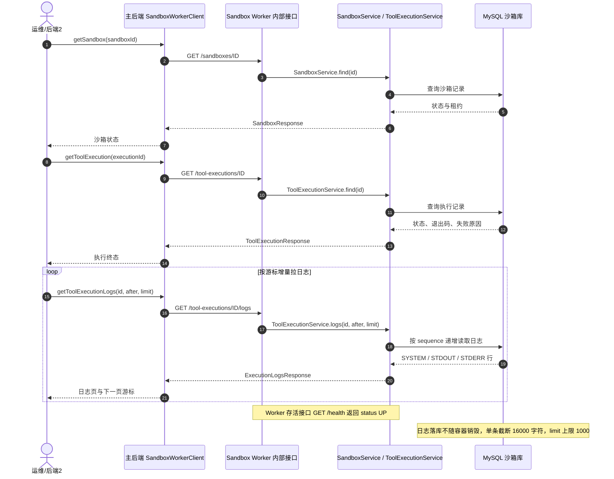

# Qgents Sandbox Worker：沙箱状态与日志查看

> **先区分三类地址**
>
> - 前端页面地址：`/app/...`，例如 `/app/projects/{projectId}/tasks/{taskId}`。用户登录后从这里查看 TaskRun 和脱敏日志。
> - 前端请求客户端使用的 API：由 `src/api/client.ts` 自动拼接并自动携带登录后的 `Authorization: Bearer <accessToken>`。开发代理模式下通常表现为 `/api/...`；生产配置可直接请求后端完整地址。
> - 后端接口契约地址：`/api/v1/...`，例如 `GET /api/v1/projects/{projectId}/task-runs/{taskRunId}/logs`。这是接口路径，不是前端页面，不能直接在地址栏打开来代替登录后的前端请求。
>
> 直接在浏览器地址栏访问 API 不会携带前端 localStorage 中的 Bearer Token，因此即使页面已经登录，也可能返回 `401 UNAUTHORIZED`。应从前端页面操作，或在开发者工具 Network 中查看前端已经发出的、带认证头的请求。

后端2（Sandbox Worker）查看沙箱状态和工具执行日志的调用链路。数据落在独立 MySQL
库 `qgents_sandbox_worker` 的 `tool_executions` 和 `tool_execution_logs`，不走 `docker logs`。
部署时须先执行 `sandbox-worker/src/main/resources/db/sandbox_worker_database.sql` 建库；Worker
启动后会幂等执行 `sandbox_worker_schema.sql` 建表。未完成这一步时，Worker 不能提供完整日志查询。

## 时序图



## 查看入口（`/internal/v1`，仅内网、必须服务令牌）

Worker 的 `/internal/v1/**` 由 `SANDBOX_BACKEND_SERVICE_TOKEN` 保护。请求必须由主后端或受控
运维程序发送 `Authorization: Bearer <service-token>`；令牌不进入前端、TaskRun 日志、SSE 或文档。
未配置令牌时接口 fail-closed，返回 `401 INTERNAL_AUTH_NOT_CONFIGURED`。

| 用途 | 接口 | 说明 |
| --- | --- | --- |
| Worker 存活 | `GET /internal/v1/health` | 返回 `{"status":"UP"}`；仍需服务令牌 |
| 沙箱状态 | `GET /internal/v1/sandboxes/{sandboxId}` | status / runtimeKind / expiresAt / maxExpiresAt；不存在返回 404 |
| 执行记录 | `GET /internal/v1/tool-executions/{executionId}` | status / exitCode / result / failureCode / failureReason |
| 执行日志 | `GET /internal/v1/tool-executions/{executionId}/logs?after={seq}&limit={n}` | 游标分页；`nextCursor` 作为下一次 `after` |

工具执行状态机：`QUEUED → RUNNING → SUCCEEDED / FAILED / TIMED_OUT / CANCELLED`。

日志流类型：`SYSTEM / STDOUT / STDERR`（表 CHECK 约束）。单条 content 截断 16000 字符，limit 上限 1000。

主后端程序化封装见 `SandboxWorkerClient`（src/main/java/qg/qgent/orchestration/worker/SandboxWorkerClient.java）。

## 从 TaskRun 定位完整 Worker 日志

### 先决条件

只有主后端配置 `SANDBOX_WORKER_ENABLED=true`，并且该 TaskRun 实际调用了 Sandbox Worker 工具时，才会产生 Worker `executionId`。如果执行走主后端本地工具实现，TaskRun 仍会有日志，但不会有 Worker `executionId`，也不能到后端 2 查询对应记录。

### 前端操作（项目成员）

1. 登录前端：`http://localhost:5173/login`。
2. 打开 Task 详情页：

   ```text
   http://localhost:5173/app/projects/{projectId}/tasks/{taskId}
   ```

3. 在“最近执行”中选择一个 TaskRun，在“运行日志”中查看脱敏日志。
4. 前端内部会通过认证请求客户端调用后端日志接口；不要手动把 `/api/v1/...` 粘贴到浏览器地址栏。
5. “失败诊断”区域会调用统一诊断接口，无论失败发生在 Worker 之前还是 Worker 工具内部，都会返回失败阶段、稳定失败码和脱敏原因；Worker 执行列表为空时表示本次没有调用 Worker。

TaskRun 详情页会把单次运行链接映射到：

```text
/app/projects/{projectId}/tasks/{taskId}/executions/{taskRunId}
```

该地址最终由前端重定向回 Task 详情页的运行检查面板。

统一诊断响应只暴露最新一条失败的 Worker 工具执行摘要：`status=FAILED` 的执行记录包含
`executionId`、工具名、状态、退出码、稳定 `failureCode` 和受控中文失败说明；成功、排队中和执行中的
Worker 不返回其 `executionId`。响应不包含工具参数、文件内容、stdout、stderr 或 Worker 原始 `failureReason`。

1. 前端页面自动按项目权限查询（等价后端接口如下）：

   ```http
   GET /api/v1/projects/{projectId}/task-runs/{taskRunId}/logs?cursor=0&limit=100
   ```

2. 如果响应中出现 `node=WORKER/file.patch`（或其他 `WORKER/*`）日志项，从其 `content` 中取得 `executionId`。例如：

   ```text
   executionId=01...，tool=file.patch，status=FAILED，failureCode=FILE_PATCH_FAILED，failureReason=补丁无法应用，请重新读取文件后重试
   ```

3. 仅由后端运维或受控诊断程序，在 Worker 内网调用。前端不调用以下地址：

   ```http
   GET /internal/v1/tool-executions/{executionId}
   GET /internal/v1/tool-executions/{executionId}/logs?after=0&limit=1000
   ```

   用 `nextCursor` 继续读取，直到不再推进。Worker 内网执行详情中的 `failureReason` 仅供受控诊断；`/logs` 返回
   `SYSTEM/STDOUT/STDERR` 行；Patch 解析失败通常没有 stdout/stderr，核心错误应看执行详情。

该内网接口不属于前端公开 API。前端只读取第 1 步的脱敏 TaskRun 日志；任何完整日志导出都必须经过项目权限、运维权限和 Secret 脱敏控制。

### 统一诊断接口

前端任务详情页首先使用 Task ID 请求统一入口，不需要先取得 `taskRunId` 或 `executionId`：

```http
GET /api/v1/projects/{projectId}/tasks/{taskId}/diagnostics
```

失败发生在 Planner/编排启动、最终交付准备或超时回收阶段时，`latestFailedRun` 可以为空，但仍会返回
`stage` 和 `failure`，因此任务失败后始终有查询入口。前端页面地址是：

```text
/app/projects/{projectId}/tasks/{taskId}
```

前端请求客户端会自动携带登录 Token，不需要用户手工打开 `/api/v1` 地址。

已经选中某个 TaskRun 时，仍可使用 TaskRun 级接口：

```http
GET /api/v1/projects/{projectId}/task-runs/{taskRunId}/diagnostics
```

响应始终以 `taskRunId/status/stage/failure/workerExecutions` 为边界：

```json
{
  "data": {
    "taskRunId": "01...",
    "taskId": "01...",
    "status": "FAILED",
    "stage": "CODING",
    "failure": {
      "code": "EXECUTION_FAILED",
      "failureCode": "CODING_NO_ACTUAL_CHANGE",
      "title": "执行失败",
      "summary": "Coding Agent 未产生实际文件修改",
      "retryable": true,
      "occurredAt": "2026-08-19T12:22:52Z"
    },
    "workerExecutions": []
  }
}
```

若实际调用过 Worker，`workerExecutions` 至多列出最新一条 `status=FAILED` 的结构化
`executionId/tool/status/failureCode/failureSummary`；成功、未完成和更早的失败执行都不会暴露。没有失败 Worker 执行时返回空数组，
但 `failure` 仍然提供主后端失败原因，因此不会再因为没有 `executionId` 而失去错误入口。

PowerShell 运维示例（令牌从受控 Secret Manager 注入，不要写入脚本、命令历史或日志）：

```powershell
$workerUrl = $env:SANDBOX_WORKER_URL
$serviceToken = $env:SANDBOX_BACKEND_SERVICE_TOKEN
$headers = @{ Authorization = "Bearer $serviceToken" }
$executionId = "<从 TaskRun 脱敏日志取得的 executionId>"

Invoke-RestMethod -Headers $headers -Uri "$workerUrl/internal/v1/tool-executions/$executionId"
$after = 0
do {
    $page = Invoke-RestMethod -Headers $headers `
        -Uri "$workerUrl/internal/v1/tool-executions/$executionId/logs?after=$after&limit=1000"
    $page.items
    $next = [long]$page.nextCursor
    if ($next -le $after) { break }
    $after = $next
} while ($true)
```

这条链路的权限边界是：项目成员只能查询脱敏 TaskRun 日志；只有后端服务或受控运维身份持有 Worker
服务令牌，才能查询完整执行详情和 `SYSTEM/STDOUT/STDERR`。若需要审计，运维程序应记录
`taskRunId`、`executionId`、操作者和时间，不记录令牌或完整日志正文。
